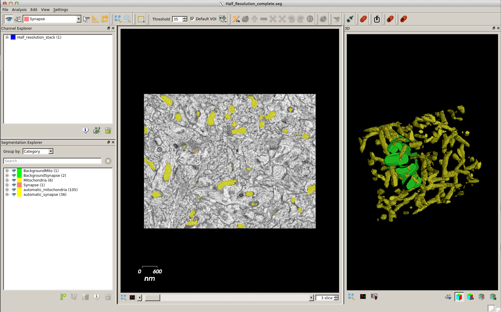

# Pol Monsó Purtí

`pol dot monso at gmail dot com`

## as a Code Developer

### Augmented Reality Development

As a software developer at Robotic Eyes, Graz, I developed several applications for Android and iOs based on Unity Engine and rexos cloud.

Codes are under Non Disclosure Agreement.

### Context-Cues Segmentation

As a software developer at the CVLab of École Polytechnique de Lausanne. I worked in a fantastic brain segmentation project with @cbecker. We implemented a plugin for the mitochondria segmentation software ESPina.

More info on [ccboost repo](https://github.com/polmonso/ccboost_segmentation).

### Helimap Navigation System 2 and Quickdrop

As a software developer at Helimap Systems, I developed a helicopter navigation system which we used in our 3d mapping missions, as well as a quick drop ortorectification software and other smaller stuff.

Unfortunately, both codes are under Non Disclosure Agreement.

### IRI ROS WAM stack

During my stay at Institut de Robòtica i Informàtica Industrial of BarcelonaTech I developed a ROS stack and low-level driver for the control of Barrett's Whole Arm Manipulator robot. The code is part of the IRI's ROS repository.

Check out [WAM's repository](https://github.com/polmonso/ros_iri_wam)

Later, I also developed a planning and manipulation for the WAM based on Partially Observable Markov Decision Processes, which made it as an [article](http://www.iri.upc.edu/files/scidoc/1365-POMDP-approach-to-robotized-clothes-separation.pdf) to the International Conference on Intelligent Robots and Systems (IROS 2012).

## as a Visual Artist

### Trilogue

As part of the [Trilogue Collective](trilogueart.wordpress.com) ([Ursula Graber](ursulagraber.wordpress.com), Pol Monsó Purtí, [Diego Jiménez Tamame](diegojimeneztamame.com)). The Trilogue Collective, focuses its work on the multiple possibilities offered by the development of synergies and feedback processes between different artistic disciplines, aspiring to redefine the boundaries between them within the framework of creation contemporary art.

The collaboration between the three artists for the first version of the Trilogue project (2017), together with the interest they share in the use of multi-media resources in their respective fields, gave birth to the Trilogue Collective, with the vocation to continue multidisciplinary artistic research through the use of technological tools.

## as a Games Developer

### Battlechess

Check out [Battlechess](polmonso.github.com/battlechess) for info!

A mix between Battleship and chess. The main plot turn being that you can only see around your pieces.

Developed together with [Antoine Letouzey](https://antoine.sxbn.org/) in our free time. Pending to set a lobby or similar to release it seriously.

### EAWars and EABattles

A long time ago, around 2008, together with @daiku60 and @kaikcreator we coded a java role-playing strategy game with an age of empires-like skirmish mini-game based on JOGL inside. It was a very interesting project which led to an intense political game with several friends.

## as a Musician

I've played as a keyboardist with [eterians](https://eterians.bandcamp.com/), [CBMD](https://cbmd.bandcamp.com/) and many others.

I usually lean to funk, jazz and blues. Or more like gloomy music when I play on my own.

Check out [eterians 28 disk](https://eterians.bandcamp.com/) for a taste.

## as a Citizen

I've been involved in [Jardins Urbains Lausannois](https://lesjul.wordpress.com/presentation/) and other Degrowth and Sustainable Development movements in Catalonia and Switzerland. Currently involved in the direct democracy initiatives in Catalonia as well as in the CDR network, aiming to secure [Article 1 of the United Nations Chart](https://treaties.un.org/doc/publication/ctc/uncharter.pdf) and free the political prisoners in Spain.

Check out [Cooperativa Integral Catalana](https://cooperativa.cat/en/) and [JUL](https://lesjul.wordpress.com/presentation/) for the former, [CDR](https://ca.wikipedia.org/wiki/Comit%C3%A8s_de_Defensa_de_la_Rep%C3%BAblica) for the later.

> **Article 1**
>
> The Purposes  of the United Nations are:
>
> 1.
>   To  maintain  international  peace  and  security,  and  to  that  end:  to  take  effective  collective measures  for  the  prevention  and  removal  of threats  to  the  peace,  and  for  the  suppression  of acts  of aggression  or other breaches  of the peace, and to bring about by peaceful means, and in conformity  with  the  principles  of  justice  and  international  law,  adjustment  or  settlement  of  international  disputes  or  situations  which  might  lead to a breach  of the peace;
>
> 2.
>   To develop friendly relations among nations based  on respect for  the principle  of equal rights and  self-determination   of  peoples,  and  to  take other appropriate measures to strengthen  universal peace;
>
> 3.
>   To  achieve   international   cooperation   in solving  international  problems  of  an  economic, social, cultural, or humanitarian character, and in promoting  and  encouraging  respect  for  human rights and for fundamental  freedoms  for all without  distinction  as  to  race,  sex,  language,  or  religion;  and
>
> 4.
>   To be a center  for  harmonizing the actions of nations in the attainment of these common ends.
